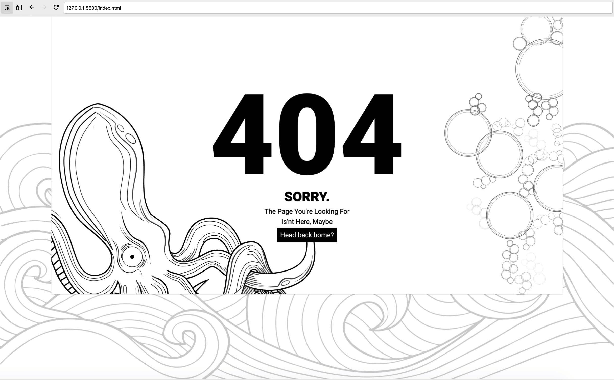

# Octopus404
### Octopus404 - a simple HTML Error page

#### TODO :
- Remove Tailwind.css
- Create a nice look on the mobile view
- Convert SVG to HTML tag

#### Tools :
1. Figma
2. Tailwind.css
3. Animate.css

#### Screenshots:

#### Demo:
[https://bardiz12.github.io/view-octopus404/index.html](https://bardiz12.github.io/view-octopus404/index.html)

#### Contributors :
<table>
    <tbody>
        <tr>
            <td>
            

                 
                <a href="https://bardiz.digital">Bardizba Z</a>
            

            </td>
            <td>
            

                 
                <a href="https://github.com/eilend">Muhamad Faishol Hakim</a>
            

            </td>
        </tr>
    </tbody>
</table>